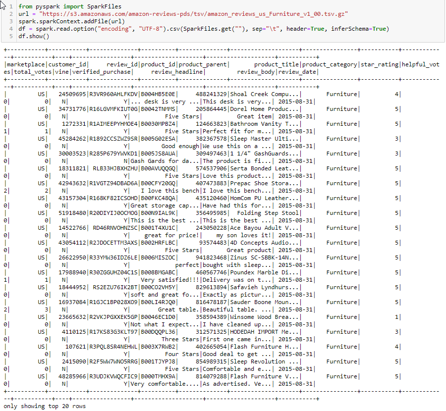

# Amazon Vine Analysis

## Project Overview
The purpose of this project was to analyze reviews of the Amazon Vine (paid review) program to determine if there was bias toward favorable reviews from Vine members compared to unpaid regular reviewers. We were tasked to select a dataset based on reviews of a specific product; for this analysis, I chose to analyze furniture products. In order to complete the analysis, I had to perform an ETL process to extract, transform, and load the data by connecting to an Amazon Web Services (AWS) Relational Database (RDS) and then load the transformed data into pgAdmin. 

## Results
The data was imported using the SparkFiles library (*see below image*). Further data processing helped me gather information to answer the following questions below.
 

**How many Vine reviews and non-Vine reviews were there?** 
*For furniture reviews on Amazon, the data analysis showed that there were 136 paid (Vine) reviews and 18,019 unpaid (non-Vine) reviews. The Vine reviews account for only 0.75% of all reviews.*

**How many Vine reviews were 5 stars? How many non-Vine reviews were 5 stars?** 
*There were 74 5-star Vine reviews and 8,482 non-Vine ones.*

**What percentage of Vine reviews were 5 stars? What percentage of non-Vine reviews were 5 stars?** 
*Percentage-wise Vine and non-Vine reviews were 54.41% and 47.07%, respectively.*

## Summary
Overall, there seems to be a *slight* bias for Vine reviews vs. non-Vine reviews because the precentage of 5-star reviews differ by around 7%. In order to draw better conclusions about biases in the Amazon Vine program, more datasets should be examined.
